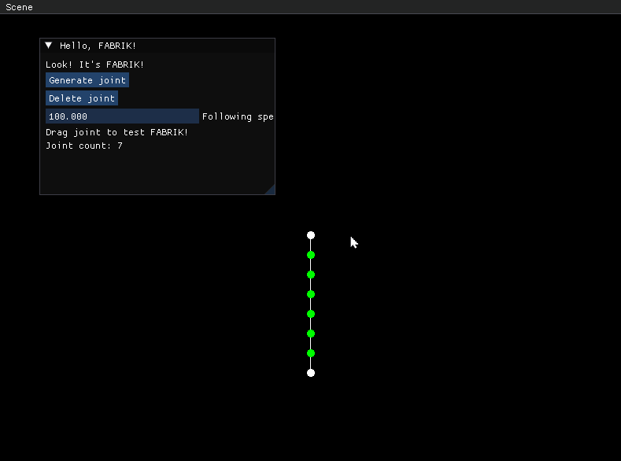

# Procedual Animation Lab  
IK, 절차적 애니메이션 실험실

## Overview
- SFML과 ImGui 기반으로 IK와 절차적 애니메이션을 실험하는 프로젝트입니다.

## Features
- **Scene Switching**: Toggle between the FABRIK testbed and the tentacle creature simulation via the ImGui menu.
- **FABRIK Test Scene**:
  - Drag joints or the end effector to observe FABRIK solving in real time.
  - Dynamically add/remove joints and adjust following speed.
- **Tentacle Creature Scene**:
  - Six-legged procedural creature that searches for reachable anchors.
  - Tune body/tentacle speed, pulling & pushing force, and retarget probability in ImGui.

## Controls
- **FABRIK Scene**
  - Left-click a joint/end effector to drag it.
  - Buttons: `Generate joint`, `Delete joint`
  - Slider: `Following speed`
  
- **Tentacle Scene**
  - Left-click in the window to move the creature’s target.
  - Buttons: `Searching holdable point`
  - Sliders: body/tentacle speed, pulling/pushing power, retarget probability.
  

## TODOs
- Angle/constraint limits for segments
- Gravity & environment interaction
- Improved anchor-search heuristics, state machines
- CCD, IK variants, more creature behaviors

## Third-party
- Dear ImGui 
- SFML
